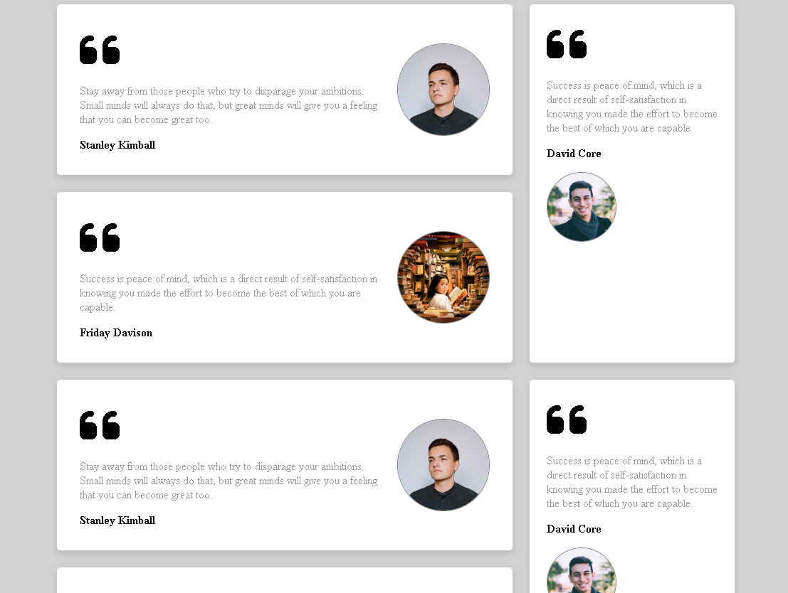
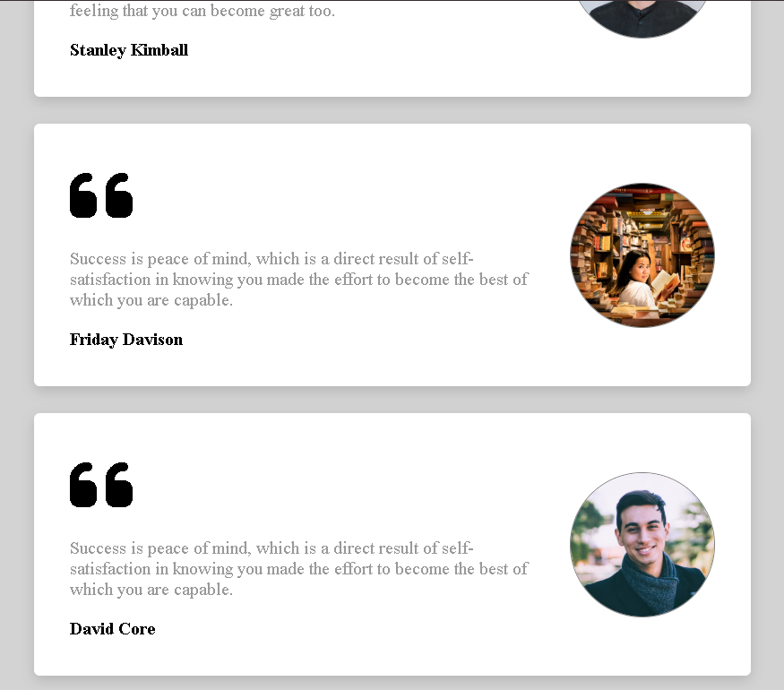

Responsive design article cards on a grid layout. It scales when adding more cards to the HTML. 3 Layouts available, depending on the screen size:

Play around zooming in and out: 
[Grid Responsive Cards](https://yoanabast.github.io/grid-responsive-cards/)

<table>
  <tr>
    <td></td>
    <td></td>
    <td></td>
  </tr>
</table>

How to add a new card: 
1. You need to place it in the main div:
<pre>
  &lt;div class="main-div"&gt;
</pre>
2. You need to keep the same class structure as the rest of the cards, see the template:
<pre>
  &lt;article class="testimonial"&gt;
      &lt;main&gt;
          &lt;i class="fa-solid fa-quote-left"&gt;&lt;/i&gt;
          &lt;p&gt; YOUR QUOTE HERE&lt;/p&gt;
          &lt;strong&gt;AUTHOR NAME&lt;/strong&gt;
      &lt;/main&gt;

      &lt;div class="image-container"&gt;
          &lt;img src="IMG PATH"
              alt="IMG ALT TEXT"&gt;
      &lt;/div&gt;
  &lt;/article&gt;
  
</pre>
3. The card will automatically scale depending on its position. Every 3rd card is pushed to the right on a big screen (see shreenshots). 
